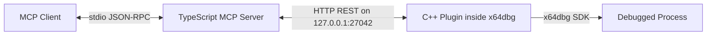

# x64dbg MCP
  

A Model Context Protocol (MCP) server for x64dbg. It exposes x64dbg's debugging
and reverse-engineering capabilities to MCP-compatible AI clients (Claude
Desktop, Cursor, and other MCP hosts), so an LLM can drive a live debug session:
read memory and registers, set breakpoints, step execution, disassemble, search,
patch, dump modules, and more. Across its 36 tools the server exposes over 393
distinct operations, plus 15 resources and 10 prompts.

The project is Windows-only (64-bit and 32-bit). It has two components that run
as separate processes and communicate over HTTP on the loopback interface.

## Highlights

- **Grouped tool design.** Each of the 36 tools takes an `action` parameter that
  selects the specific operation, so one tool covers a whole family of related
  endpoints instead of needing a separate tool per command. This keeps the tool
  list compact while exposing 393+ distinct operations.
- **Native x64dbg integration.** Ships as a real plugin with a menu, a settings
  dialog, and auto-start on load. It runs inside x64dbg and calls the SDK
  directly -- there is no scripting shim or external automation layer in the
  path.
- **C++ plugin plus TypeScript server.** The plugin is C++23 for direct,
  low-overhead SDK access; the server is TypeScript built on the official
  `@modelcontextprotocol/sdk` and speaks stdio with the client.
- **Resilient connection.** Automatic health monitoring, reconnection, and retry
  logic mean a tool call survives the plugin briefly going offline (for example
  while x64dbg restarts a target).
- **Localhost-only by default.** Binds to `127.0.0.1` and supports an optional
  bearer token. The API is never exposed to the network or to local browsers.
- **State tooling.** Debugger-state snapshots, snapshot diffing, and expression
  watchdogs make it practical to track changes across a long session.

## Quick start

This is currently a build-from-source project; no prebuilt download is provided.
The end-to-end flow is four steps, each detailed in the sections below:

1. **Build the plugin** -- install the prerequisites, then run `fetch-sdk.ps1`
   and CMake in `plugin/` to produce `x64dbg_mcp.dp64` (or `.dp32`).
2. **Build the server** -- run `npm install && npm run build` in `server/`.
3. **Install the plugin** -- drop the `.dp64`/`.dp32` file into the matching
   x64dbg `plugins` folder and launch x64dbg.
4. **Point an MCP client at the server** -- add the server to your client config
   and restart the client.

If someone has already built the plugin for you, you only need steps 3 and 4.

## How it works



- **`server/`** -- A TypeScript MCP server (`@modelcontextprotocol/sdk`) that
  speaks stdio with the MCP client. It registers 36 tools, 15 resources, and 10
  prompts. Each tool call is translated into one or more HTTP requests against
  the plugin.
- **`plugin/`** -- A C++23 x64dbg plugin (`x64dbg_mcp.dp64` / `.dp32`) that runs
  inside x64dbg. It starts a small HTTP server, dispatches requests to handlers
  that call the x64dbg SDK, and returns JSON results. It binds to `127.0.0.1`
  only and never exposes the API to the network.

The MCP client starts the server; the server connects to the plugin that is
already loaded in x64dbg. The two do not need to be started in a particular
order -- the server waits for the plugin to come online.

## Prerequisites

### For the server

- [Node.js](https://nodejs.org/) 18 or later (includes npm).

### For the plugin (build from source)

- Windows 10 or later.
- [x64dbg](https://x64dbg.com) (a snapshot build). This is what loads the plugin.
- [Visual Studio 2022](https://visualstudio.microsoft.com/) with the
  **Desktop development with C++** workload, plus the optional component
  **C++ Clang tools for Windows** (provides `clang-cl`).
- [CMake](https://cmake.org/) 3.25 or later (required for CMakePresets version 6).
- [Ninja](https://ninja-build.org/) (bundled with the VS C++ workload; otherwise
  install separately and put it on `PATH`).
- [vcpkg](https://github.com/microsoft/vcpkg), with the `VCPKG_ROOT` environment
  variable pointing at your vcpkg checkout.
- Internet access for the first plugin build (the x64dbg plugin SDK is downloaded
  from GitHub; subsequent builds are cached and work offline).

> If you only want to use the project and someone has already built the plugin,
> you can skip the plugin build toolchain and just copy the compiled `.dp64`
> file into x64dbg.

## Build

### 1. Set up vcpkg (one time)

Clone and bootstrap vcpkg, then set `VCPKG_ROOT` so CMake can find it:

```powershell
git clone https://github.com/microsoft/vcpkg.git C:\vcpkg
C:\vcpkg\bootstrap-vcpkg.bat
setx VCPKG_ROOT "C:\vcpkg"
```

Open a **new** terminal after `setx` so the variable takes effect.

### 2. Build the plugin

The plugin needs the x64dbg plugin SDK (headers and import libraries). The
`fetch-sdk.ps1` script downloads it from the latest x64dbg GitHub release and
caches it under `plugin/sdk/`.

```powershell
cd plugin
.\fetch-sdk.ps1
cmake --preset x64-release
cmake --build --preset x64-release
```

This produces `plugin/build/x64-release/bin/x64dbg_mcp.dp64`.

To build a 32-bit plugin instead, use the `x32-release` preset, which produces
`x64dbg_mcp.dp32` under `plugin/build/x32-release/bin/`. A debug build is
available via the `x64-debug` preset.

### 3. Build the server

```powershell
cd server
npm install
npm run build
```

This compiles the TypeScript to `server/dist/`. The entry point is
`server/dist/index.js`.

## Install the plugin in x64dbg

1. Locate your x64dbg installation. It contains an `x64` folder (for the 64-bit
   debugger) and an `x32` folder (for the 32-bit debugger).
2. Copy the matching file into the `plugins` folder next to the debugger
   executable:
   - 64-bit: copy `x64dbg_mcp.dp64` into `<x64dbg>\x64\plugins\`
   - 32-bit: copy `x64dbg_mcp.dp32` into `<x64dbg>\x32\plugins\`
3. Launch x64dbg. A new **x64dbg MCP** menu appears with **Start Server**,
   **Stop Server**, **Settings...**, and **About...** entries. The server
   auto-starts on load by default.

You can confirm the server is running from the x64dbg log window, or by running
the `mcpserver status` command in the x64dbg command line. The `mcpserver`
command also accepts `start` and `stop`.

## Configure an MCP client

Add the server to your MCP client's configuration. The server uses stdio, so the
client launches it as a child process and communicates over its standard streams.

Example configuration (Claude Desktop `claude_desktop_config.json`, found at
`%APPDATA%\Claude\claude_desktop_config.json` on Windows):

```json
{
  "mcpServers": {
    "x64dbg": {
      "command": "node",
      "args": ["C:/path/to/x64dbg-MCP/server/dist/index.js"],
      "env": {
        "X64DBG_MCP_HOST": "127.0.0.1",
        "X64DBG_MCP_PORT": "27042"
      }
    }
  }
}
```

Adjust the `args` path to the absolute location of `server/dist/index.js` on your
machine. Restart the client after saving the file.

### Environment variables

All are optional. The defaults match the plugin defaults, so a stock setup needs
none of them.

| Variable | Default | Description |
|---|---|---|
| `X64DBG_MCP_HOST` | `127.0.0.1` | Host the plugin HTTP server listens on. |
| `X64DBG_MCP_PORT` | `27042` | Port the plugin HTTP server listens on. |
| `X64DBG_MCP_TIMEOUT` | `0` | Per-request timeout in milliseconds. `0` waits indefinitely (useful for long operations such as tracing). |
| `X64DBG_MCP_RETRIES` | `3` | Connection-error retry attempts before failing a request. |
| `X64DBG_MCP_TOKEN` | (empty) | Bearer token sent to the plugin for authentication. Leave empty unless you set a matching token in the plugin settings. |

The same host, port, and token can be changed inside x64dbg through the plugin's
**Settings...** dialog and are persisted across sessions.

## Run

1. Start x64dbg and open or attach to a target process. The plugin's HTTP server
   starts automatically on load.
2. Start (or restart) your MCP client. It launches the server, which polls the
   plugin until it is reachable.
3. From the client, invoke any of the exposed tools. Most operations require an
   active debug session (a loaded target); calls made without one return a
   conflict error.

## Connection behavior

- On startup the server begins polling `GET /api/health` every 15 seconds.
- On the first tool call, if the plugin is not yet reachable, the server waits up
  to 120 seconds for it to come online (polling every 2 seconds), then fails with
  a clear error if it does not.
- If the plugin goes offline mid-session (for example x64dbg is closed), the
  server marks itself disconnected and retries on the next call.
- Requests that fail with connection errors are retried up to `X64DBG_MCP_RETRIES`
  times with increasing backoff. HTTP-level errors (4xx/5xx from the plugin) are
  returned immediately and are not retried.

## What is exposed

### Tools (36)

Each tool takes an `action` parameter that selects the specific operation, so
one tool covers a related group of HTTP endpoints. This grouped design is why
36 tools expose 393+ operations while keeping the tool list compact and
self-describing. The tools most commonly used to drive a session are marked in
**bold**.

| Tool | Purpose |
|---|---|
| **`x64dbg_debug`** | Run, pause, step (into/over/out), init, attach, detach, restart, run-to, and state queries |
| `x64dbg_command` | Execute x64dbg commands, evaluate expressions, run scripts, and read/write the database |
| `x64dbg_registers` | Read all/single registers, write a register, read flags and AVX-512 state |
| **`x64dbg_memory`** | Read, write, allocate, free, protect, and query pages and validity |
| `x64dbg_disassembly` | Disassemble at an address or over a whole function; assemble an instruction |
| **`x64dbg_breakpoints`** | Set/remove/list/toggle software, hardware, and memory breakpoints and configure conditions |
| `x64dbg_symbols` | Resolve names to addresses and vice versa, list and search module symbols |
| `x64dbg_stack` | Read the stack, walk the call stack, read return address and SEH chain |
| `x64dbg_threads` | List, switch, suspend, resume, create, and kill threads |
| `x64dbg_modules` | List modules and read base, section, party, imports, and exports |
| **`x64dbg_search`** | Search memory for byte patterns, strings, references, and assembled instructions |
| `x64dbg_find_pattern` | Search for assembly instruction patterns (indirect calls, stack access, API calls, jump tables) |
| `x64dbg_analysis` | Function boundaries, cross-references, basic blocks, constants, error codes, source locations |
| `x64dbg_database` | List constants, error codes, structs, and module strings |
| `x64dbg_address_convert` | Convert between virtual addresses and file offsets |
| `x64dbg_watchdog` | Check watch-expression watchdog state |
| `x64dbg_analyze_module` | Run multiple analysis passes in a single call |
| `x64dbg_events` | Subscribe to and unsubscribe from debugger events (breakpoint hits, exceptions, module loads) |
| **`x64dbg_tracing`** | Trace into/over with logging, configure trace files and records |
| `x64dbg_dumping` | Dump memory and modules, parse PE headers, sections, imports, exports, and relocations |
| `x64dbg_antidebug` | Read PEB/TEB, hide the debugger, and check DEP status |
| `x64dbg_exceptions` | Configure exception breakpoints and list exception codes |
| `x64dbg_process` | Process details, command line, elevation, and debugger version |
| `x64dbg_handles` | Enumerate handles, TCP connections, windows, and heaps |
| `x64dbg_control_flow` | Control-flow graph, branch destinations, loops, and function definitions |
| `x64dbg_patches` | Apply, list, revert, and export patches |
| `x64dbg_advanced_dump` | Module analysis, OEP detection, PE rebuild, and configurable dumping |
| `x64dbg_context` | Capture and compare debugger-state snapshots |
| `x64dbg_function` | List functions and read function boundaries |
| **`x64dbg_script`** | Execute scripts, batch commands, multi-step script-engine runs, and conditional workflows with branching |
| `x64dbg_system` | Server info, ping, method listing, and permissions |
| `x64dbg_assembler` | Assemble an instruction at an address |
| `x64dbg_bookmark` | Set, delete, and list bookmarks |
| `x64dbg_snapshot_diff` | Capture and compare named state snapshots |
| **`x64dbg_auto_patch`** | Apply common patch patterns (NOP, JMP, conditional invert, RET, set byte) |
| `x64dbg_batch_annotate` | Set multiple labels, comments, or bookmarks in a single call |

### Resources (15)

State the client can fetch on demand by URI:

- `x64dbg://state`, `x64dbg://registers`, `x64dbg://modules`, `x64dbg://threads`,
  `x64dbg://memory_map`, `x64dbg://breakpoints`, `x64dbg://stack`,
  `x64dbg://stack_trace`
- Parameterized templates: `x64dbg://memory/{address}/{size}`,
  `x64dbg://disassembly/{address}/{count}`, `x64dbg://module/{name}`,
  `x64dbg://symbol/{name}`, `x64dbg://function/{address}`,
  `x64dbg://export/{module}`, `x64dbg://import/{module}`

### Prompts (10)

Pre-built workflows the client can invoke: `debug_session`, `analyze_crash`,
`unpack_binary`, `trace_function`, `find_vulnerability`, `reverse_algorithm`,
`api_monitor`, `patch_code`, `hunt_strings`, `compare_state`.

## Performance and reliability

- **Native plugin, not automation.** The plugin is compiled C++ running inside
  x64dbg and calls the SDK directly. Tool calls do not pass through a scripting
  layer, so per-call overhead is low.
- **Automatic reconnection.** If the plugin is unreachable when a call is made
  (for example, while x64dbg is restarting a target), the server waits for it to
  come back online, then retries. See [Connection behavior](#connection-behavior).
- **Retry with backoff.** Connection-level failures are retried up to
  `X64DBG_MCP_RETRIES` times with increasing backoff; HTTP errors returned by the
  plugin are passed through immediately so you get fast, clear feedback.
- **State snapshots and watchdogs.** The `x64dbg_context`, `x64dbg_snapshot_diff`,
  and `x64dbg_watchdog` tools let a client capture state, compare it between
  steps, and be notified when a watched expression changes -- useful for long
  sessions where you want to track drift instead of polling manually.
- **Long-operation support.** `X64DBG_MCP_TIMEOUT` defaults to `0` (wait
  indefinitely), so operations such as tracing or running to a breakpoint are not
  cut short by a short client timeout.

## Project layout

```
.
├── server/                 TypeScript MCP server
│   ├── src/
│   │   ├── index.ts        Entry point; creates the MCP server over stdio
│   │   ├── config.ts       Reads environment variables
│   │   ├── http_client.ts  HTTP client, health monitor, retries
│   │   ├── tools/          Tool registrations, grouped by category
│   │   ├── resources/      Resource registrations
│   │   └── prompts/        Prompt registrations
│   ├── package.json
│   ├── tsconfig.json
│   └── server.json         Tool/resource/prompt manifest
└── plugin/                 C++ x64dbg plugin
    ├── src/
    │   ├── plugin_main.cpp     Plugin lifecycle, menu, settings, route wiring
    │   ├── http/               HTTP server, router, request/response structs
    │   ├── bridge/             Adapter that calls the x64dbg SDK
    │   ├── handlers/           HTTP route handlers, grouped by category
    │   ├── ui/                 Settings and About dialogs
    │   ├── util/               Formatting helpers and shared trace state
    │   └── resources/          Embedded plugin icon
    ├── CMakeLists.txt
    ├── CMakePresets.json
    ├── vcpkg.json
    ├── fetch-sdk.ps1           Downloads the x64dbg plugin SDK
    └── plugin.def              Exported plugin entry points
```

## Security notes

- The plugin binds to `127.0.0.1` only. It is not reachable from other machines.
- The HTTP responses intentionally omit CORS headers, so a web page loaded in a
  local browser cannot drive the debugger. The API is meant to be consumed by the
  local Node server only.
- Authentication is optional. If you set an auth token in the plugin settings,
  the server must send the same token (`X64DBG_MCP_TOKEN`), otherwise requests
  are rejected with 401. With no token set, no authentication is required.

## Troubleshooting

- **Plugin does not appear in x64dbg.** Confirm the file is in the correct
  `plugins` folder and that the architecture matches (`dp64` with the 64-bit
  debugger, `dp32` with the 32-bit debugger). Check the x64dbg log for load
  errors.
- **Server reports the plugin is unreachable.** Ensure x64dbg is running with the
  plugin loaded and that nothing else is using port 27042. If you changed the port
  in the plugin settings, set `X64DBG_MCP_PORT` to match.
- **CMake configure fails.** Verify `VCPKG_ROOT` is set in the current terminal,
  and that `clang-cl` and `ninja` are on `PATH` (installed via the VS C++ and
  Clang components).
- **`fetch-sdk.ps1` fails.** It needs internet access on the first run to
  download the SDK. If it fails after the SDK is already cached, the build can
  proceed with the existing local copy.

## License

MIT
